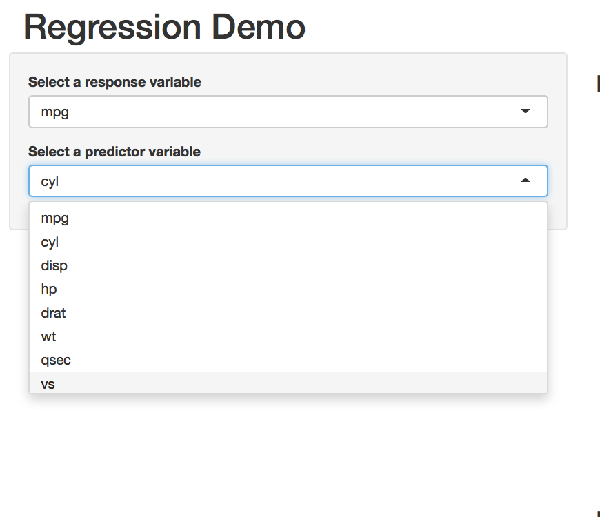

Regression Demo - shinyapp
========================================================
author: Hardeep Arora
date: Sat Sep 26 23:29:04 2015

Overview
========================================================

This [shiny app](https://hardeeparora.shinyapps.io/mtcars) demos using single variable regression on *mtcars* dataset.

Inputs
========================================================
In allows you to choose the *response* and the *predictor* variable from the drop down list. Once you choose the values the output section is updated.

Outputs
========================================================
In the output section it shows
- A scatter plot of the chosen variables
- Regression line between the response and predictor
- Confidence intervals
- Regression coefficients

Demo
========================================================
Let's see a demo plot between mpg as predictor and cyl as reponse variable

 

